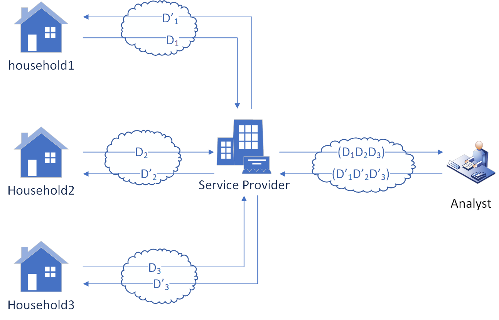

# Introduction

This is the code for protecting privacy using selective homomorphic encryption via Lattigo Library.
The core idea is to find out which sections of data should be encrypted based on the metric of entropy, transition or data uniqueness.

<p align="center">
	
</p>

The smart metering system mode is simplified. There is multiple clients but one central server, as well as third-party analysts. Also, for the safe distribution of HE keys, Certificate Authority will be applied. And the code is to show how to use selective encryption for the balance of data privacy and system performance.

The preprocessed data has been put into the example\dataset folder.

The code is running on Windows platform, and not tested on Linux or Mac.

### Testing performance among different block size choices
```bash
$ go run .\blocksize_choices\test_blocks.go 1 1 80
```
Params meaning: strategy, dataset, maxHouseholdsNumber

Testcase meaning: Calculate block size performance for 80 households in the Water dataset using the Global encryption strategy

### Testing privacy metrics like entropy, transition
```bash
$ go run .\privacy_metrics\test_metrics.go 1 1 1 80
```
Params meaning: strategy, dataset, target, maxHouseholdsNumber

Testcase meaning: Calculate block size performance for 80 households in the Water dataset using the Global encryption strategy and Entropy-based selection strategy

### Testing attack success rate based on entropy or transition
```bash
$ go run .\asr\test_asr.go 1 1 1 0 60 24 80
```
Params meaning: strategy, dataset, target, uniqueATD, encryptionRatio, atdSize, maxHouseholdsNumber

Testcase meaning: Calculate the ASR for 80 households in the Water dataset, that is 80% encrypted, using the Global encryption strategy, Entropy-based selection strategy, and non-unique attacker data block

### Testing attack success rate based on data uniqueness
```bash
$ go run .\asr_uniqueness\test_uniqueness.go 1 2 0 1 60 20
```
Params meaning: strategy, dataset, uniqueATD, target, encryptionRatio, maxHouseholdsNumber